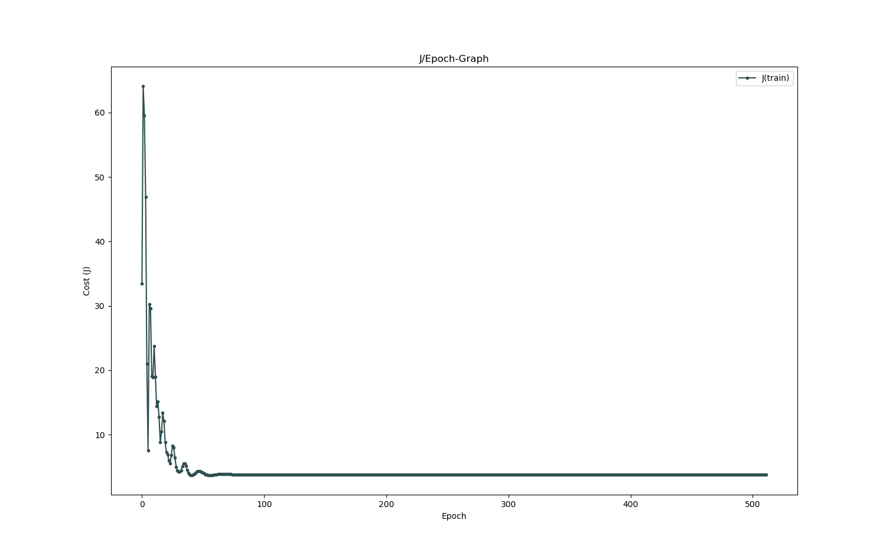
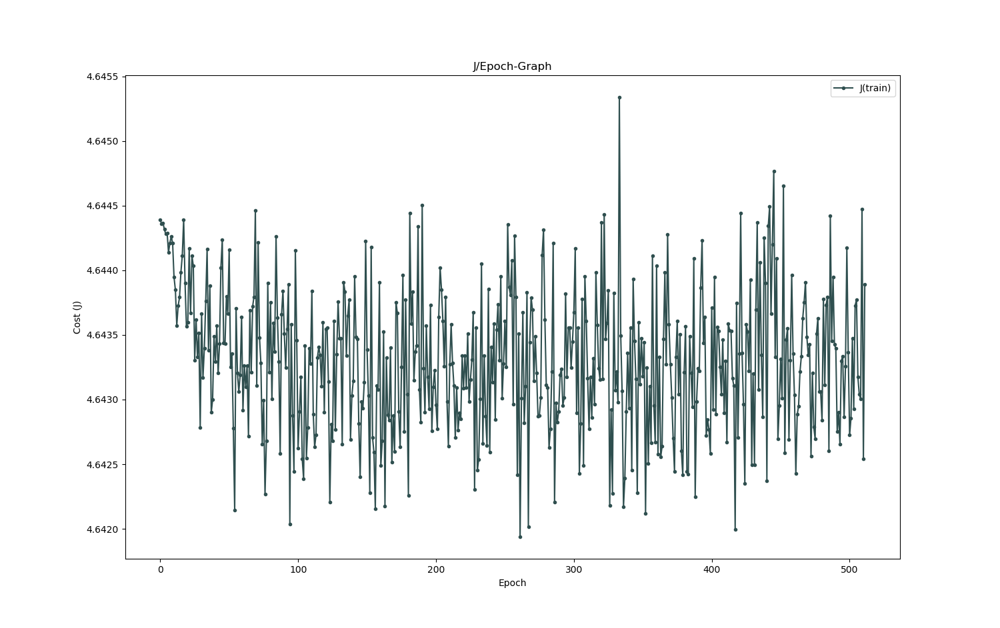

# RNN (LSTM) - Goethe Generation
_Simple RNN generating Goethe Poems_

---

## About

This is yet another little test project. I thought of doing this, in order to gain more experience in working with Recurrent Neural Networks (especially with "Long Short Term Memory"-Gates). 

## To-Do

* [x] Dataset preparation
* [x] Simple weight initialization
* [x] Advanced weight initialization (Xavier initialization, etc.)
* [x] Simple bias initialization
* [x] Fully connected layer/s
* [x] Activation functions (sigmoid, tanh, softmax)
* [x] Loss-Function (Cross-Entropy)
* [x] Gradient computation function
* [x] Stochastic Mini Batch Gradient Descent
* [x] Advanced SGD (Momentum, Adam, etc.)
* [x] J/Epoch-Graph
* [x] Prediction function
* _... probably more to come ..._

## Results

~~Sadly, I appear to be having very acute high-bias problems. At the moment I'm unsure as to whether this is due to my choice of hyper-parameters or because of a misfunction in my gradient computation. In order to fix this, first, I'll re-check the code and if I can't find any mistakes, I'll write some functions to help me pick the hyper-parameters which allow for the best convergence.~~

~~
_J/Epoch-Graph displaying the bad convergence_~~

**Fixed:** There were some problems with the previous code.

Now, all that's left is to find the right hyper-parameters, as it still doesn't converge to a very low loss. However, I truly hope that this task can be solved in the next couple of days and that the network will soon be able to generate texts character by character in a similar fashion to the famous German poet Johann Wolfgang von Goethe.

_P.S.:_ The code has worked on a much easier dataset with little to no problems before, which allows me to conclude that all of the troubles with convergence are now a pure hyper-parameters issue. (Or there's too little data ... )

---

... MattMoony (August, 2019)